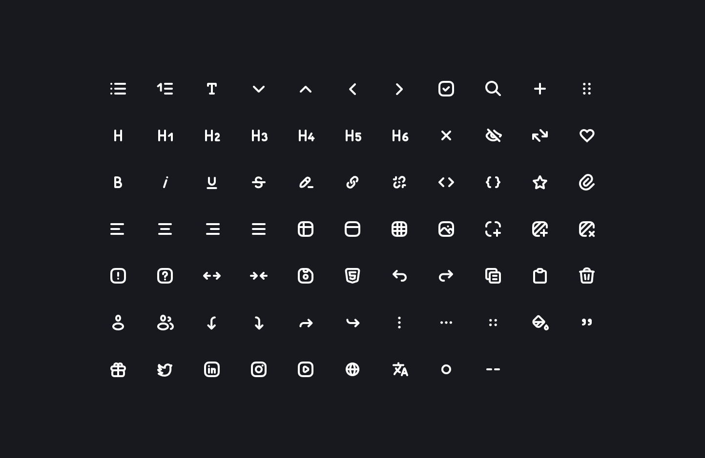

# CodeX Icons Nuxt module

This modules simplifies using of CodeX Icons pack in the Nuxt projects.

[](https://github.com/codex-team/icons/tree/master/packages/nuxt)

## Features

1. 💖 Dynamic loading
2. 💝 Coloring
3. 💞 HMR (reloading on update in dev mode)

## Installation

1. Get the package

```bash
yarn add @codexteam/nuxt-icons
```

2. Add module to the `nuxt.config.ts`

```js
export default defineNuxtConfig({
  modules: [
    '@codexteam/nuxt-icons'
  ]
})
```

## Usage

Use the `codex-icon` component with the `name` property which should be one of the [list](https://github.com/codex-team/icons#list-of-icons).

```vue
<codex-icon name="IconHeart" />
```

## Properties

There are few properties available for component:

| prop | type | description |
| -- | -- | -- |
| `name` | string | Required. Name of icon from CodeX Icons pack |
| `class` | string | Class name to be added to the icon wrapper |
| `size` | number | Icon width and height value |

# About CodeX


CodeX is a team of digital specialists around the world interested in building high-quality open source products on a global market. We are [open](https://codex.so/join) for young people who want to constantly improve their skills and grow professionally with experiments in cutting-edge technologies.

| 🌐 | Join  👋  | Twitter | Instagram |
| -- | -- | -- | -- |
| [codex.so](https://codex.so) | [codex.so/join](https://codex.so/join) |[@codex_team](http://twitter.com/codex_team) | [@codex_team](http://instagram.com/codex_team/) |

